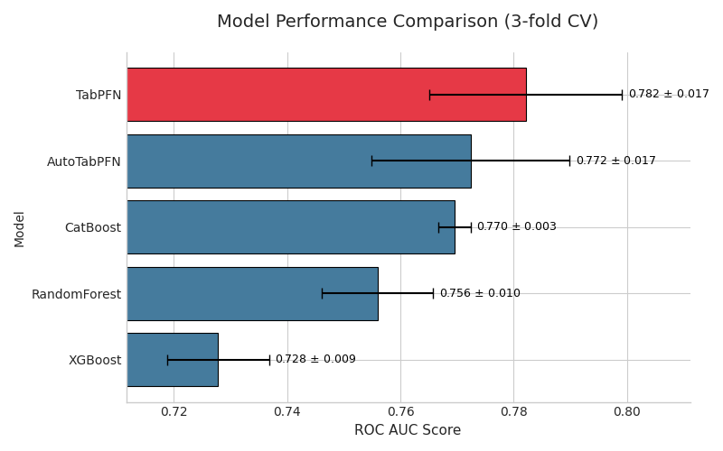
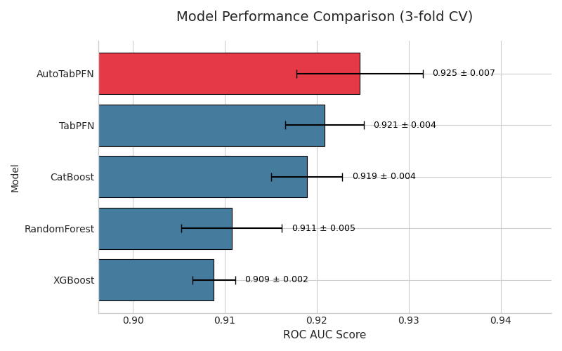
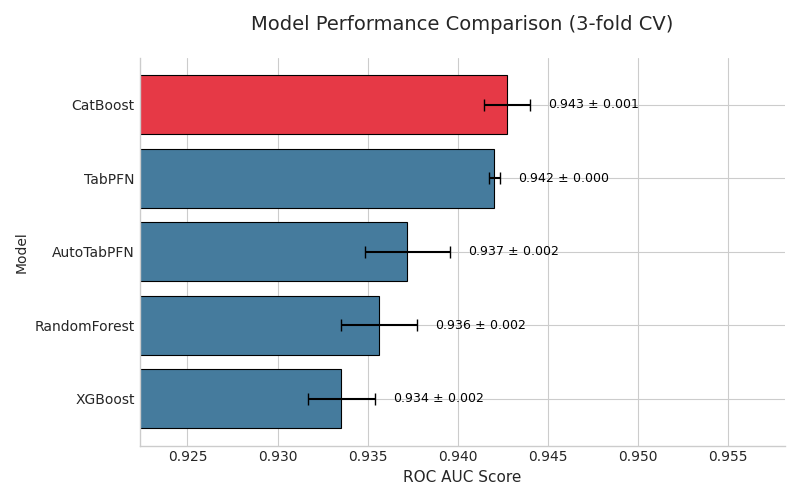
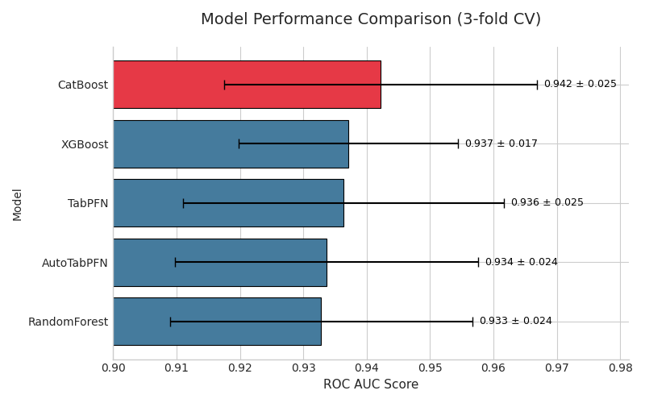
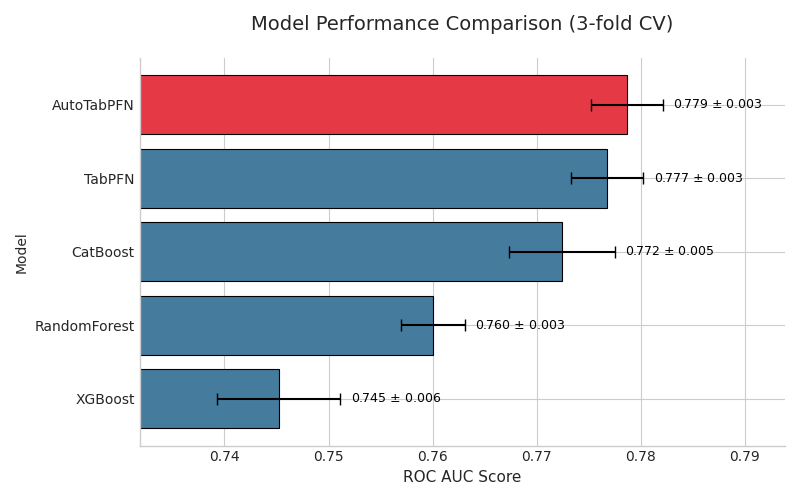
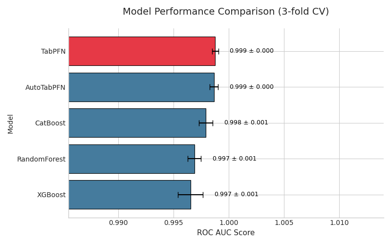
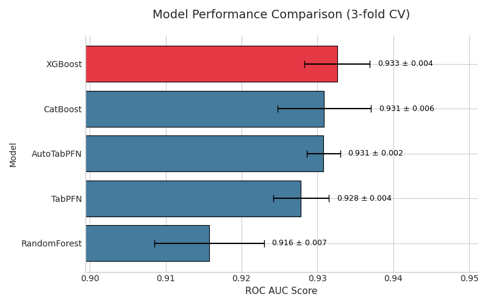
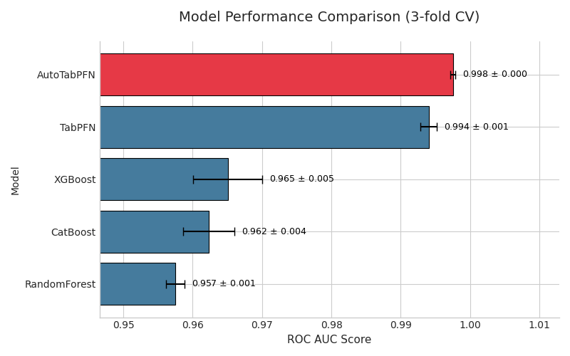
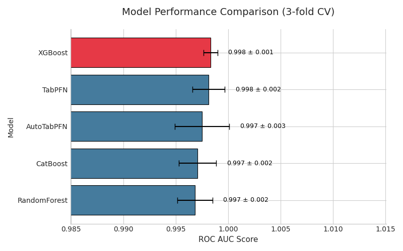
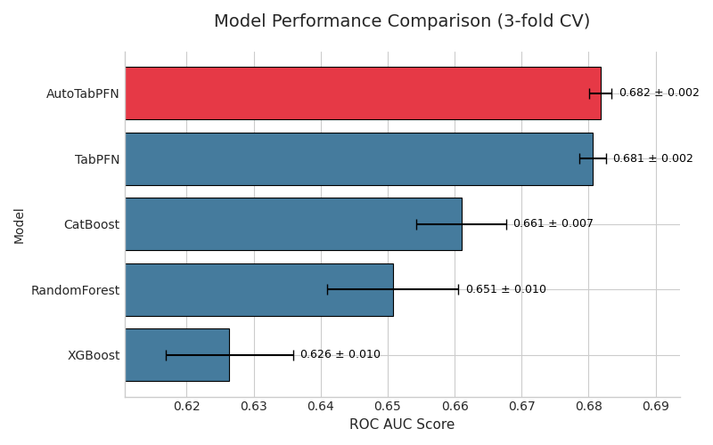

# Benchmarking Tabular Data in Banking and Finance

To evaluate model performance on common finance tasks such as banking, credit modeling, loan approval, etc., we benchmarked several tabular datasets. This section details the datasets used in our analysis, including a summary of their metadata and the resulting performance metrics.

## 1. `german-credit`
- **Description:** This dataset classifies people described by a set of attributes as good or bad credit risks
- **Source:** <a href="https://archive.ics.uci.edu/dataset/144/statlog+german+credit+data">UCIMLR</a>
- **#Rows:** 1000
- **#Features:** 21
- **Target:** `class`
- **#Views:** 178848 (as of September 29, 2025)
- **#Citations:** 63 (as of September 29, 2025)
- **Additional Description:**  Provided by Prof. Hofmann at 10.24432/C5NC77
- **Features:** 
`Attribute 1`:  (qualitative)      
 Status of existing checking account
           A11 :      ... <    0 DM
           A12 : 0 <= ... <  200 DM
           A13 :      ... >= 200 DM / salary assignments for at least 1 year
           A14 : no checking account 
`Attribute 2`:  (numerical)
          Duration in month 
`Attribute 3`:  (qualitative)
          Credit history
          A30 : no credits taken/ all credits paid back duly
              A31 : all credits at this bank paid back duly
          A32 : existing credits paid back duly till now
              A33 : delay in paying off in the past
          A34 : critical account/  other credits existing (not at this bank) 
`Attribute 4`:  (qualitative)
          Purpose
          A40 : car (new)
          A41 : car (used)
          A42 : furniture/equipment
          A43 : radio/television
          A44 : domestic appliances
          A45 : repairs
          A46 : education
          A47 : (vacation - does not exist?)
          A48 : retraining
          A49 : business
          A410 : others 
`Attribute 5`:  (numerical)
          Credit amount 
`Attibute 6`:  (qualitative)
          Savings account/bonds
          A61 :          ... <  100 DM
          A62 :   100 <= ... <  500 DM
          A63 :   500 <= ... < 1000 DM
          A64 :          .. >= 1000 DM
              A65 :   unknown/ no savings account 
`Attribute 7`:  (qualitative)
          Present employment since
          A71 : unemployed
          A72 :       ... < 1 year
          A73 : 1  <= ... < 4 years  
          A74 : 4  <= ... < 7 years
          A75 :       .. >= 7 years 
`Attribute 8`:  (numerical)
          Installment rate in percentage of disposable income 
`Attribute 9`:  (qualitative)
          Personal status and sex
          A91 : male   : divorced/separated
          A92 : female : divorced/separated/married
              A93 : male   : single
          A94 : male   : married/widowed
          A95 : female : single 
`Attribute 10`: (qualitative)
          Other debtors / guarantors
          A101 : none
          A102 : co-applicant
          A103 : guarantor 
`Attribute 11`: (numerical)
          Present residence since 
`Attribute 12`: (qualitative)
          Property
          A121 : real estate
          A122 : if not A121 : building society savings agreement/ life insurance
              A123 : if not A121/A122 : car or other, not in attribute 6
          A124 : unknown / no property 
`Attribute 13`: (numerical)
          Age in years 
`Attribute 14`: (qualitative)
          Other installment plans 
          A141 : bank
          A142 : stores
          A143 : none 
`Attribute 15`: (qualitative)
          Housing
          A151 : rent
          A152 : own
          A153 : for free 
`Attribute 16`: (numerical)
              Number of existing credits at this bank 
`Attribute 17`: (qualitative)
          Job
          A171 : unemployed/ unskilled  - non-resident
          A172 : unskilled - resident
          A173 : skilled employee / official
          A174 : management/ self-employed/
             highly qualified employee/ officer 
`Attribute 18`: (numerical)
          Number of people being liable to provide maintenance for 
`Attribute 19`: (qualitative)
          Telephone
          A191 : none
          A192 : yes, registered under the customers name 
`Attribute 20`: (qualitative)
          foreign worker
          A201 : yes
          A202 : no 
`class (Target)`: (numerical)
          good or bad
          1 : Good
          2 : Bad 
- **Model Performance:** 

## 2. `bank-marketing`
- **Description:**  The classification goal is to predict if the client will subscribe a term deposit (variable y).
- **Source:** <a href="https://archive.ics.uci.edu/dataset/222/bank+marketing">UCIMLR</a>
- **#Rows:** 45211
- **#Features:** 17
- **Target:** `y`
- **#Views:** 513689  (as of September 29, 2025)
- **#Downloads:**  (as of September 29, 2025)
- **#Citations:** 9
- **Additional Description:** The data is related with direct marketing campaigns (phone calls) of a Portuguese banking institution.
- **Features:**  
   `age` (numeric) 
   `job` : type of job (categorical: "admin.","unknown","unemployed","management","housemaid","entrepreneur","student",
                                       "blue-collar","self-employed","retired","technician","services")  
   `marital` : marital status (categorical: "married","divorced","single"; note: "divorced" means divorced or widowed) 
   `education` (categorical: "unknown","secondary","primary","tertiary") 
   `default`: has credit in default? (binary: "yes","no") 
   `balance`: average yearly balance, in euros (numeric)  
   `housing`: has housing loan? (binary: "yes","no") 
   `loan`: has personal loan? (binary: "yes","no") 
   `contact`: contact communication type (categorical: "unknown","telephone","cellular")  
   `day`: last contact day of the month (numeric) 
   `month`: last contact month of year (categorical: "jan", "feb", "mar", ..., "nov", "dec") 
   `duration`: last contact duration, in seconds (numeric) 
   `campaign`: number of contacts performed during this campaign and for this client (numeric, includes last contact) 
   `pdays`: number of days that passed by after the client was last contacted from a previous campaign (numeric, -1 means client was not previously contacted) 
   `previous`: number of contacts performed before this campaign and for this client (numeric) 
   `poutcome`: outcome of the previous marketing campaign (categorical: "unknown","other","failure","success") 
   `y (Target)` - has the client subscribed a term deposit? (binary: "yes","no") 
- **Model Performance:** 

## 3. `credit-approval`
- **Description:** This data concerns credit card applications; good mix of attributes
- **Source:** <a href="https://archive.ics.uci.edu/dataset/27/credit+approval">UCIMLR</a>
- **#Rows:** 690
- **#Features:** 16 
- **Target:** `A16`
- **#Views:** 108380 (as of September 29, 2025)
- **#Downloads:**  (as of September 29, 2025)
- **#Citations:** 12
- **Additional Description:** All attribute names and values have been changed to meaningless symbols to protect confidentiality of the data.
- **Features:**  
`A1`:	b, a. 
`A2`:	continuous. 
`A3`:	continuous. 
`A4`:	u, y, l, t. 
`A5`:	g, p, gg. 
`A6`:	c, d, cc, i, j, k, m, r, q, w, x, e, aa, ff. 
`A7`:	v, h, bb, j, n, z, dd, ff, o. 
`A8`:	continuous. 
`A9`:	t, f. 
`A10`:	t, f. 
`A11`:	continuous. 
`A12`:	t, f. 
`A13`:	g, p, s. 
`A14`:	continuous. 
`A15`:	continuous. 
`A16 (Target)`: +,- (class attribute) 
- **Model Performance:** 

## 4. `australian-credit`
- **Description:** This file concerns australian credit card applications. This database exists elsewhere in the repository (Credit Screening Database) in a slightly different form
- **Source:** 
- **#Rows:** 690
- **#Features:** 15 
- **Target:** `A15`
- **#Views:** 26995 (as of September 29, 2025)
- **#Downloads:**  (as of September 29, 2025)
- **#Citations:** 4
- **Additional Description:** All attribute names and values have been changed to meaningless symbols to protect confidentiality of the data.
- **Features:**  
There are 6 numerical and 8 categorical attributes.  The labels have been changed for the convenience of the statistical algorithms.  For example, attribute 4 originally had 3 labels p,g,gg and these have been changed to labels 1,2,3.            
`A1`: 0,1    CATEGORICAL (formerly: a,b) 
`A2`: continuous. 
`A3`: continuous. 
`A4`: 1,2,3    CATEGORICAL  (formerly: p,g,gg) 
`A5`: 1, 2,3,4,5, 6,7,8,9,10,11,12,13,14    CATEGORICAL (formerly: ff,d,i,k,j,aa,m,c,w, e, q, r,cc, x) 
`A6`: 1, 2,3, 4,5,6,7,8,9    CATEGORICAL (formerly: ff,dd,j,bb,v,n,o,h,z) 
`A7`: continuous. 
`A8`: 1, 0    CATEGORICAL (formerly: t, f) 
`A9`: 1, 0	CATEGORICAL (formerly: t, f) 
`A10`:  continuous. 
`A11`:  1, 0	    CATEGORICAL (formerly t, f) 
`A12`:  1, 2, 3    CATEGORICAL (formerly: s, g, p)  
`A13`:  continuous. 
`A14`:  continuous. 
`A15 (Target)`:   1,2  class attribute (formerly: +,-)  
- **Model Performance:** 

## 5. `default-credit-card`
- **Description:** This research aimed at the case of customers' default payments in Taiwan and compares the predictive accuracy of probability of default among six data mining methods.
- **Source:** <a href="https://archive.ics.uci.edu/dataset/350/default+of+credit+card+clients">UCIMLR</a>
- **#Rows:** 30000
- **#Features:** 24
- **Target:** `Y`
- **#Views:** 183542 (as of September 29, 2025)
- **#Downloads:**  (as of September 29, 2025)
- **#Citations:** 3
- **Additional Description:** This research aimed at the case of customers' default payments in Taiwan and compares the predictive accuracy of probability of default among six data mining methods. From the perspective of risk management, the result of predictive accuracy of the estimated probability of default will be more valuable than the binary result of classification - credible or not credible clients. Because the real probability of default is unknown, this study presented the novel Sorting Smoothing Method to estimate the real probability of default. With the real probability of default as the response variable (Y), and the predictive probability of default as the independent variable (X), the simple linear regression result (Y = A + BX) shows that the forecasting model produced by artificial neural network has the highest coefficient of determination; its regression intercept (A) is close to zero, and regression coefficient (B) to one. Therefore, among the six data mining techniques, artificial neural network is the only one that can accurately estimate the real probability of default.
- **Features:**  
This research employed a binary variable, default payment (Yes = 1, No = 0), as the response variable. This study reviewed the literature and used the following 23 variables as explanatory variables: 
`X1`: Amount of the given credit (NT dollar): it includes both the individual consumer credit and his/her family (supplementary) credit. 
`X2`: Gender (1 = male; 2 = female). 
`X3`: Education (1 = graduate school; 2 = university; 3 = high school; 4 = others). 
`X4`: Marital status (1 = married; 2 = single; 3 = others). 
`X5`: Age (year). 
`X6 - X11`: History of past payment. We tracked the past monthly payment records (from April to September, 2005) as follows: X6 = the repayment status in September, 2005; X7 = the repayment status in August, 2005; . . .;X11 = the repayment status in April, 2005. The measurement scale for the repayment status is: -1 = pay duly; 1 = payment delay for one month; 2 = payment delay for two months; . . .; 8 = payment delay for eight months; 9 = payment delay for nine months and above. 
`X12-X17`: Amount of bill statement (NT dollar). X12 = amount of bill statement in September, 2005; X13 = amount of bill statement in August, 2005; . . .; X17 = amount of bill statement in April, 2005.  
`X18-X23`: Amount of previous payment (NT dollar). X18 = amount paid in September, 2005; X19 = amount paid in August, 2005; . . .;X23 = amount paid in April, 2005. 
`Y (Target)`: default payment next month 
- **Model Performance:** 

<!-- ## 6. `credit-card-approval`
- **Description:** application_record.csv contains appliers personal information, which you could use as features for predicting credit_record.csv records users' behaviors of credit card.
- **Source:** <a href="https://www.kaggle.com/datasets/rikdifos/credit-card-approval-prediction/data">Kaggle </a>
- **Files:**  , 
- **#Rows:** 438558
- **#Features:** 21 (18 from application_record + 3 from credit_record)
- **Target:** `STATUS`
- **#Views:** 686000 (as of September 28, 2025)
- **#Downloads:** 91700 (as of September 28, 2025)
- **Additional Description:** "Credit score cards are a common risk control method in the financial industry. It uses personal information and data submitted by credit card applicants to predict the probability of future defaults and credit card borrowings. The bank is able to decide whether to issue a credit card to the applicant. Credit scores can objectively quantify the magnitude of risk. Generally speaking, credit score cards are based on historical data. Once encountering large economic fluctuations. Past models may lose their original predictive power. Logistic model is a common method for credit scoring. Because Logistic is suitable for binary classification tasks and can calculate the coefficients of each feature. In order to facilitate understanding and operation, the score card will multiply the logistic regression coefficient by a certain value (such as 100) and round it. At present, with the development of machine learning algorithms. More predictive methods such as Boosting, Random Forest, and Support Vector Machines have been introduced into credit card scoring. However, these methods often do not have good transparency. It may be difficult to provide customers and regulators with a reason for rejection or acceptance. Build a machine learning model to predict if an applicant is 'good' or 'bad' client, different from other tasks, the definition of 'good' or 'bad' is not given. You should use some techique, such as vintage analysis to construct you label. Also, unbalance data problem is a big problem in this task."
- **Features:** There're two tables could be merged by ID: 
--- 
`application_record.csv`: 
--- 
`ID`	Client number	 
`CODE_GENDER`	Gender	 
`FLAG_OWN_CAR`	Is there a car	 
`FLAG_OWN_REALTY`	Is there a property	 
`CNT_CHILDREN`	Number of children	 
`AMT_INCOME_TOTAL`	Annual income	 
`NAME_INCOME_TYPE`	Income category	 
`NAME_EDUCATION_TYPE`	Education level	 
`NAME_FAMILY_STATUS`	Marital status	 
`NAME_HOUSING_TYPE`	Way of living	 
`DAYS_BIRTH`	Birthday	Count backwards from current day (0), -1 means yesterday 
`DAYS_EMPLOYED`	Start date of employment	Count backwards from current day(0). If positive, it means the person currently unemployed. 
`FLAG_MOBIL`	Is there a mobile phone	 
`FLAG_WORK_PHONE`	Is there a work phone	 
`FLAG_PHONE`	Is there a phone	 
`FLAG_EMAIL`	Is there an email	 
`OCCUPATION_TYPE`	Occupation	 
`CNT_FAM_MEMBERS`	Family size	 
--- 
`credit_record.csv`:		 
--- 
`ID`	Client number	 
`MONTHS_BALANCE`	Record month	The month of the extracted data is the starting point, backwards, 0 is the current month, -1 is the previous month, and so on 
`STATUS (Target)`	Status	0: 1-29 days past due 1: 30-59 days past due 2: 60-89 days overdue 3: 90-119 days overdue 4: 120-149 days overdue 5: Overdue or bad debts, write-offs for more than 150 days C: paid off that month X: No loan for the month
- **Model Performance:** 
 -->

## 6. `loan-modelling`
- **Description:** The data include customer demographic information (age, income, etc.), the customer's relationship with the bank (mortgage, securities account, etc.), and the customer response to the last personal loan campaign (Personal Loan). Among these 5000 customers, only 480 (= 9.6%) accepted the personal loan that was offered to them in the earlier campaign.
- **Source:** <a href="https://www.kaggle.com/datasets/teertha/personal-loan-modeling">Kaggle</a>
- **File:**  
- **#Rows:** 5000
- **#Features:** 14
- **Target:** `Personal_Loan`
- **#Views:** 61300 (as of September 29, 2025)
- **#Downloads:** 9739 (as of September 29, 2025)
- **Additional Description:** "This case is about a bank (Thera Bank) whose management wants to explore ways of converting its liability customers to personal loan customers (while retaining them as depositors). A campaign that the bank ran last year for liability customers showed a healthy conversion rate of over 9% success. This has encouraged the retail marketing department to devise campaigns with better target marketing to increase the success ratio with minimal budget."
- **Features:**  
`ID`: Customer ID  
`Age`: Customer’s age in completed years 
`Experience`: #years of professional experience 
`Income`: Annual income of the customer (in thousand dollars) 
`ZIP Code`: Home Address ZIP code. 
`Family`: the Family size of the customer 
`CCAvg`: Average spending on credit cards per month (in thousand dollars) 
`Education`: Education Level. 1: Undergrad; 2: Graduate;3: Advanced/Professional 
`Mortgage`: Value of house mortgage if any. (in thousand dollars) 
`Securities_Account`: Does the customer have securities account with the bank? 
`CD_Account`: Does the customer have a certificate of deposit (CD) account with the bank? 
`Online`: Do customers use internet banking facilities? 
`CreditCard`: Does the customer use a credit card issued by any other Bank (excluding All life Bank)? 
`Personal_Loan (Target)`: Did this customer accept the personal loan offered in the last campaign? 
- **Model Performance:** 

## 7. `credit-risk`
- **Description:** This dataset contains columns simulating credit bureau data
- **Source:** <a href="https://www.kaggle.com/datasets/laotse/credit-risk-dataset/">Kaggle</a>
- **File:**  
- **#Rows:** 32581
- **#Features:** 12
- **Target:** `loan_status`
- **#Views:** 271000 (as of September 29, 2025)
- **#Downloads:** 46100  (as of September 29, 2025)
- **Additional Description:**
- **Features:**  
`person_age`: Age of the individual applying for the loan. 
`person_income`: Annual income of the individual. 
`person_home_ownership`: Type of home ownership of the individual. 
    |- rent: The individual is currently renting a property. 
    |- mortgage: The individual has a mortgage on the property they own. 
    |- own: The individual owns their home outright. 
    |- other: Other categories of home ownership that may be specific to the dataset. 
`person_emp_length`: Employment length of the individual in years. 
`loan_intent`: The intent behind the loan application. 
`loan_grade`: The grade assigned to the loan based on the creditworthiness of the borrower. 
    |- A: The borrower has a high creditworthiness, indicating low risk. 
    |- B: The borrower is relatively low-risk, but not as creditworthy as Grade A. 
    |- C: The borrower's creditworthiness is moderate. 
    |- D: The borrower is considered to have higher risk compared to previous grades. 
    |- E: The borrower's creditworthiness is lower, indicating a higher risk. 
    |- F: The borrower poses a significant credit risk. 
    |- G: The borrower's creditworthiness is the lowest, signifying the highest risk. 
`loan_amnt`: The loan amount requested by the individual. 
`loan_int_rate`: The interest rate associated with the loan. 
`loan_percent_income`: The percentage of income represented by the loan amount. 
`cb_person_default_on_file`: Historical default of the individual as per credit bureau records. 
    |- Y: The individual has a history of defaults on their credit file. 
    |- N: The individual does not have any history of defaults. 
`cb_preson_cred_hist_length`: The length of credit history for the individual. 
`loan_status (Target)`: Loan status, where 0 indicates non-default and 1 indicates default. 
    - 0: Non-default - The borrower successfully repaid the loan as agreed, and there was no default.
    - 1: Default - The borrower failed to repay the loan according to the agreed-upon terms and defaulted on the loan. 
- **Model Performance:** 

<!-- ## 9. `credit-score`
- **Description:**  Given a person’s credit-related information, build a machine learning model that can classify the credit score
- **Source:** <a href="https://www.kaggle.com/datasets/parisrohan/credit-score-classification">Kaggle</a>
- **File:**  
- **#Rows:** 100000
- **#Features:** 28
- **Target:** `credit_score`
- **#Views:** 290000 (as of September 29, 2025)
- **#Downloads:** 50200 (as of September 29, 2025)
- **Additional Description:** You are working as a data scientist in a global finance company. Over the years, the company has collected basic bank details and gathered a lot of credit-related information. The management wants to build an intelligent system to segregate the people into credit score brackets to reduce the manual efforts. This dataset provides a comprehensive view of customer profiles, encompassing demographic details, financial histories, and payment patterns that play a crucial role in evaluating credit risk. The goal is to clean and analyze this data to identify key features suitable for training Machine Learning and Deep Learning Algorithms.
- **Features:**  
`id`	Unique identifier for each record. 
`customer_id`	Unique identifier for each customer. 
`month`	Month of the transaction or record. 
`name`	Customer’s name. 
`age`	The customer’s age. 
`ssn`	Customer’s social security number. 
`occupation`	The customer’s occupation. 
`annual_income`	The customer’s annual income. 
`monthly_inhand_salary`	The customer’s monthly take-home salary. 
`num_bank_accounts`	Total number of bank accounts owned by the customer. 
`num_credit_card`	Total number of credit cards held by the customer. 
`interest_rate`	The interest rate applied to loans or credits. 
`num_of_loan`	Number of loans the customer has taken. 
`type_of_loan`	Categories of loans obtained by the customer. 
`delay_from_due_date`	The delay in payment relative to the due date. 
`num_of_delayed_payment`	Total instances of late payments made by the customer. 
`changed_credit_limit`	Adjustments made to the customer’s credit limit. 
`num_credit_inquiries`	Number of inquiries made regarding the customer's credit. 
`credit_mix`	The variety of credit types the customer uses (e.g., loans, credit cards). 
`outstanding_debt`	Total amount of debt the customer currently owes. 
`credit_utilization_ratio`	Proportion of credit used compared to the total credit limit. 
`credit_history_age`	Duration of the customer’s credit history. 
`payment_of_min_amount`	Indicates if the customer pays the minimum required amount each month. 
`total_emi_per_month`	Total Equated Monthly Installment (EMI) paid by the customer. 
`amount_invested_monthly`	Monthly investment amount made by the customer. 
`payment_behaviour`	Customer’s payment habits and tendencies. 
`monthly_balance`	The remaining balance in the customer’s account at the end of each month. 
`credit_score (Target)`	The customer’s credit score (target variable: "Good," "Poor," "Standard"). 
- **Model Performance:** 
 -->

<!-- ## 10. `credit-fraud`
- **Description:** 
- **Source:** <a href="https://www.kaggle.com/datasets/mlg-ulb/creditcardfraud/data">Kaggle</a>
- **File:**  
- **#Rows:** 284,807
- **#Features:** 31
- **Target:** `Class`
- **#Views:**  12100000 (as of September 29, 2025)
- **#Downloads:** 990000 (as of September 29, 2025)
- **Additional Description:** "It is important that credit card companies are able to recognize fraudulent credit card transactions so that customers are not charged for items that they did not purchase. The dataset contains transactions made by credit cards in September 2013 by European cardholders. This dataset presents transactions that occurred in two days where we have 492 frauds out of 284,807 transactions. The dataset is highly unbalanced, the positive class (frauds) account for 0.172% of all transactions. The dataset has been collected and analysed during a research collaboration of Worldline and the Machine Learning Group (http://mlg.ulb.ac.be) of ULB (Université Libre de Bruxelles) on big data mining and fraud detection. More details on current and past projects on related topics are available on https://www.researchgate.net/project/Fraud-detection-5 and the page of the DefeatFraud project"
- **Features:**  
`Time`	`V1`	`V2`	`V3`	`V4`	`V5`	`V6`	`V7`	`V8`	`V9`	`V10`	`V11`	`V12`	`V13`	`V14`	`V15`	`V16`	`V17`	`V18`	`V19`	`V20`	`V21`	`V22`	`V23`	`V24`	`V25`	`V26`	`V27`	`V28`	`Amount`	`Class (Target)`
- **Model Performance:** 
 -->

## 8. `hmeq`
- **Description:** The Home Equity dataset (HMEQ) contains baseline and loan performance information for 5,960 recent home equity loans. The target (BAD) is a binary variable indicating whether an applicant eventually defaulted or was seriously delinquent. This adverse outcome occurred in 1,189 cases (20%). For each applicant, 12 input variables were recorded.
- **Source:** <a href="https://www.kaggle.com/datasets/ajay1735/hmeq-data/">Kaggle</a>
- **File:**  
- **#Rows:** 5960
- **#Features:** 13
- **Target:** `BAD`
- **#Views:**  77300 (as of September 29, 2025)
- **#Downloads:** 9017 (as of September 29, 2025)
- **Additional Description:** 
The consumer credit department of a bank wants to automate the decisionmaking process for approval of home equity lines of credit. To do this, they will follow the recommendations of the Equal Credit Opportunity Act to create an empirically derived and statistically sound credit scoring model. The model will be based on data collected from recent applicants granted credit through the current process of loan underwriting. The model will be built from predictive modeling tools, but the created model must be sufficiently interpretable to provide a reason for any adverse actions (rejections).
- **Features:**  
`LOAN` Amount of the loan request 
`MORTDUE` Amount due on existing mortgage 
`VALUE` Value of current property 
`REASON` DebtCon = debt consolidation HomeImp = home improvement 
`JOB` Six occupational categories 
`YOJ` Years at present job 
`DEROG` Number of major derogatory reports 
`DELINQ` Number of delinquent credit lines 
`CLAGE` Age of oldest trade line in months 
`NINQ` Number of recent credit lines 
`CLNO` Number of credit lines 
`DEBTINC` Debt-to-income ratio 
`BAD (Target)` 1 = client defaulted on loan 0 = loan repaid 
- **Model Performance:** 

## 9. `loan-approval`
- **Description:** Loan Approval Dataset used for Prediction Model 
- **Source:** <a href="https://www.kaggle.com/datasets/architsharma01/loan-approval-prediction-dataset">Kaggle</a>
- **File:**  
- **#Rows:** 4269
- **#Features:** 13
- **Target:** `loan_status`
- **#Views:**  143000 (as of September 29, 2025)
- **#Downloads:** 33800 (as of September 29, 2025)
- **Additional Description:**  The loan approval dataset is a collection of financial records and associated information used to determine the eligibility of individuals or organizations for obtaining loans from a lending institution. It includes various factors such as cibil score, income, employment status, loan term, loan amount, assets value, and loan status. This dataset is commonly used in machine learning and data analysis to develop models and algorithms that predict the likelihood of loan approval based on the given features.
- **Features:**  
`loan_id` : ID 
`no_of_dependents`: Number of Dependents of the Applicant 
`education`: Education of the Applicant (Graduate/Not Graduate) 
`self_employed`: Employment Status of the Applicant 
`income_annum`: Annual Income of the Applicant 
`loan_amount`: Loan Amount 
`loan_term`: Loan Term in Years 
`cibil_score`: Credit Score 
`residential_assets_value`: Amount of Residential Assests  
`commercial_assets_value`: Amount of Commercial Assests  
`luxury_assets_value`: Amount of Luxury Items Assests  
`bank_asset_value`: Amount of Bank Assests  
`loan_status (Target)`: Loan Approval Status (Approved/Rejected) 
- **Model Performance:** 

## 10. `loan-repay`
- **Description:** Use the lending data from 2007-2010 to classify and predict whether or not the borrower paid back their loan in full
- **Source:** <a href="https://www.kaggle.com/datasets/itssuru/loan-data">Kaggle</a>
- **File:**  
- **#Rows:** 9578
- **#Features:** 14
- **Target:** `not fully paid.`
- **#Views:**  86200 (as of September 29, 2025)
- **#Downloads:**  14900 (as of September 29, 2025)
- **Additional Description:** Publicly available data from LendingClub.com. Lending Club connects people who need money (borrowers) with people who have money (investors). Hopefully, as an investor you would want to invest in people who showed a profile of having a high probability of paying you back.
- **Features:**  
`credit.policy`: This binary feature reflects whether the borrower meets LendingClub.com's credit underwriting criteria (1) or not (0). This indicator is crucial as it signifies the outcome of the initial creditworthiness assessment based on the lender's policy. 
`purpose`: A categorical variable that represents the loan's purpose, including categories like 'credit_card', 'debt_consolidation', 'educational', 'major_purchase', 'small_business', and 'all_other'. The purpose of the loan is vital as it influences the loan's risk profile and the likelihood of repayment. 
`int.rate`: The loan's interest rate represented as a proportion (e.g., 0.11 for 11%). Interest rates are pivotal as they reflect the lender's risk assessment—higher rates often correlate with perceived higher borrower risk. 
`installment`: The monthly installment amount the borrower must pay if the loan is funded. Installments are significant as their size can impact the borrower's repayment capacity, especially relative to their income and other debts. 
`log.annual.inc`: The natural logarithm of the borrower's self-reported annual income. Employing the logarithm reduces income distribution skewness, facilitating better modeling. 
`dti`: The debt-to-income ratio, computed as debt divided by annual income. A higher DTI suggests that a large income portion is allocated to debt servicing, potentially affecting loan repayment. 
`fico`: The FICO credit score, a critical measure of creditworthiness influencing loan approval and terms. 
`days.with.cr.line`: The number of days the borrower has had a credit line, where longer histories might imply more financial reliability. 
`revol.bal`: The borrower's unpaid balance at the credit cycle end, with higher balances possibly indicating financial strain. 
`revol.util`: The rate at which the borrower utilizes their revolving credit line. Higher rates can signify elevated credit risk. 
`inq.last.6mths`: The count of credit inquiries in the last six months, where more inquiries can suggest increased credit-seeking behavior and potential risk. 
`delinq.2yrs`: Instances of being 30+ days late on payments in the past two years, reflecting on the borrower's reliability.
`pub.rec`: The count of derogatory public records like bankruptcy filings or tax liens, which can significantly impact creditworthiness. 
`not.fully.paid (Target)`: The binary target variable indicating whether the loan was not fully repaid (1) or was (0). Our predictive modeling efforts focus on this outcome.
- **Model Performance:** 

## 14. `dummy`
- **Description:** 
- **Source:** 
- **#Rows:** 
- **#Features:** 
- **Target:** ``
- **#Views:**  (as of Month x, 2025)
- **#Downloads:**  (as of Month x, 2025)
- **#Citations:**
- **Additional Description:**
- **Features:**  

---

**Contact:** For questions or contributions, reach out to me @ anshulg2743@gmail.com.
