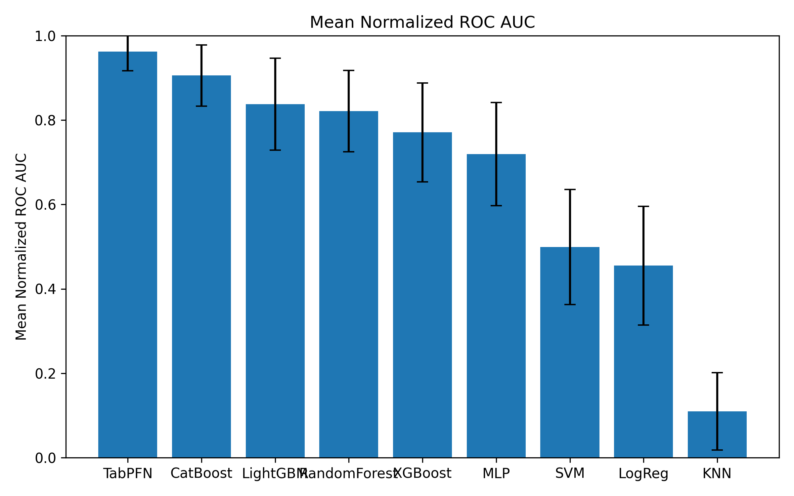
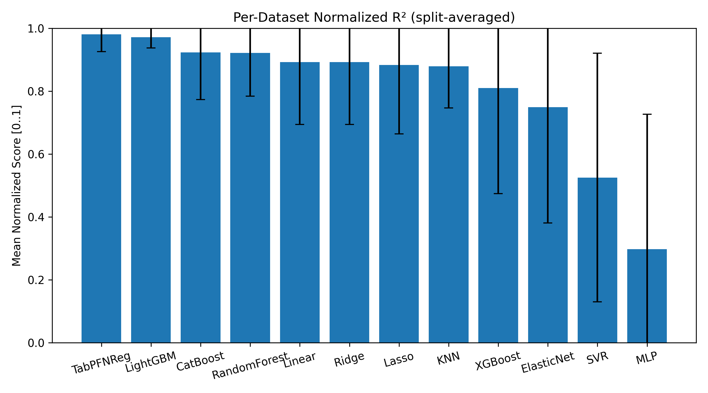

# Domain Specific Benchmarking of Tabular Data 

To evaluate model performance on common finance tasks such as finance, banking, credit modeling, loan approval, asset management, and real estate, healthcare, energy, customerlife management, industrial, predictive maintenane we benchmarked several tabular datasets. This section details the datasets used in our analysis, including a summary of their metadata and the resulting performance metrics.

## Interactive Notebook Tutorial
> [!TIP]
>
> Dive right in with our interactive Colab notebook! It's the best way to get a hands-on feel for TabPFN, walking you through installation, classification, and regression examples on benchmarking tabular data.
>
<!-- > For Customer Life Management:  -->

<!-- > For Energy:  -->

> For Finance: 

> For Healthcare: 

<!-- > For Industry:  -->

## Data Description
For datasets and additional information refer to dataset documentation under each domain in [/datasets](./datasets/) directory.

## Results 
We did the experiments for 10 splits using KFolds strategy on the domain specific classification and regression datasets, for which the normalized results can be found in the [/results](./results/) directory. Few intersting insights can be found using the links below:
<!--  -->
<!--   -->
[Normalized Bar Plot Mean ROC-AUC for Banking, Credit, Loan Applications (Classification)](results/finance/classification_results/mean_normalized_roc_auc_bar.png) 
[Normalized Scatter Plot Catboost vs TabPFN Comparison for Real Estate and Asset Management (Regression)](results/finance/regression_results/regression_benchmark_scatter_CatBoost_vs_TabPFNReg_r2.pdf) 
[Normalized Bar Plot TabPFN Comparison for Real Estate and Asset Management (Regression)](results/finance/regression_results/regression_benchmark_main_results_barplot_r2.pdf) 
**Contact:** For questions or contributions, reach out to me @ anshulg2743@gmail.com.
